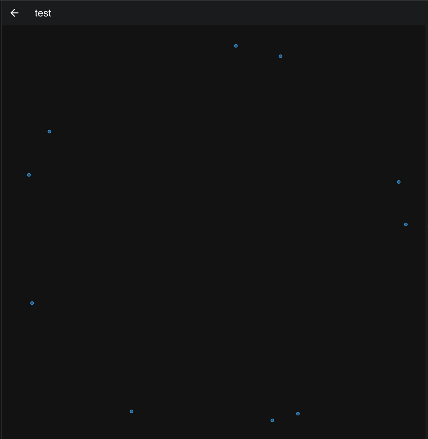

# Rust VectorDB

This project is a simple demonstration of how to interact with a Qdrant database using its Rust API. Qdrant is a vector database designed for high-load systems and it provides a gRPC API for interaction. In this project, we use a local Docker image of Qdrant.

## Setup

Before running the project, you need to start a Qdrant Docker image. You can do this by running the following command:

```bash
docker run -p 6333:6333 -p 6334:6334 \
    -e QDRANT__SERVICE__GRPC_PORT="6334" \
    qdrant/qdrant
```

This command pulls the Qdrant image from Docker Hub and runs it. The `-p` flags map the ports 6333 and 6334 of the container to the same ports of the host machine. The `-e` flag sets the environment variable `QDRANT__SERVICE__GRPC_PORT` to "6334" inside the container.

## Code Explanation

The `main.rs` file contains the main logic of the project. Here's what it does:

1. **Connects to the Qdrant database**: The code creates a `QdrantClient` instance using the URL "http://localhost:6334". This client is used to interact with the Qdrant database.

2. **Clears the "test" collection**: The code checks if a collection named "test" exists in the database and deletes it if it does. This is done to ensure a clean state before the new data is inserted.

3. **Inserts points**: The code then creates 10 points, each with a single payload value from `a:1` to `j:10`. These points are inserted into the "test" collection in the Qdrant database.

4. **Queries the points**: Finally, the code performs a search query on the "test" collection. It searches for the point with the value of "b" equal to 2.

Each of these steps is performed asynchronously, and any errors encountered during these operations are propagated up and handled in the main function.

This project serves as a basic example of how to interact with a Qdrant database using its Rust API.

As a bonus, Qdrant also includes a dashboard which can be used, among other things, to visualize the data stored in the database. You can access the dashboard by visiting `http://localhost:6333` in your browser.

Here is a screenshot of the dashboard showing the points inserted by the code:

It is quite flat, as there are not many points and the dimensionality is low. But it gives an idea of how the data is stored in the database.